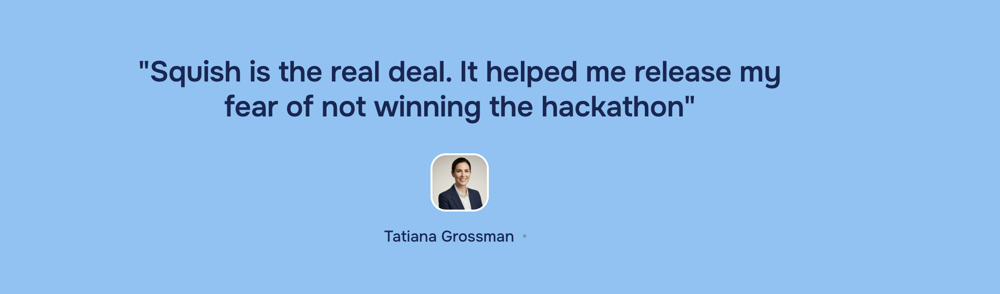

# Squish — AI Voice Meditation App

An AI‑powered, voice‑first meditation and wellness web app built with Next.js 15, React 19, Tailwind CSS 4, Supabase, and Vapi for real‑time conversational guidance. It also includes an optional Inkeep AI Concierge widget for contextual assistance.

<div align="center">
  
  <br />
  <sub>Calm your mind. Find your flow.</sub>
  <br /><br />
</div>

---
## Screenshots
### Landing Page


### How it works


### 


## Features

- **Voice sessions**: Start and complete guided sessions with real‑time AI voice via Vapi
- **Auth‑ready**: Supabase client/server helpers wired for SSR
- **Stats endpoint**: Basic user stats API scaffold
- **Inkeep Concierge (optional)**: Embeddable help/search widget
- **Modern UI**: Tailwind CSS 4, responsive components, simple layout
- **API routes**: Session lifecycle, Vapi token + webhook, user stats

## Tech Stack

- **Framework**: Next.js 15 (App Router), React 19
- **Styling**: Tailwind CSS 4, PostCSS
- **Backend**: Next.js API routes
- **Database**: Supabase (Postgres + Auth)
- **Voice/RT**: Vapi (`@vapi-ai/web`)
- **DX**: TypeScript, ESLint 9

## Project Structure

```
src/
  app/
    api/
      sessions/
        start/route.ts        # Start a session
        complete/route.ts     # Complete a session
      user/stats/route.ts     # User stats
      vapi/
        token/route.ts        # Ephemeral client token
        webhook/route.ts      # Vapi event webhook
    auth/callback/page.tsx    # Auth callback
    page.tsx                  # Landing page
    voice/page.tsx            # Voice meditation experience
  components/
    VoicePanel.tsx            # Main voice UI
    AuthButtons.tsx           # Sign-in/out buttons
    InkeepWidget.tsx          # Optional concierge widget
  lib/
    supabase-client.ts        # Browser Supabase client
    supabase-server.ts        # Server-side Supabase helpers
supabase/
  schema.sql                  # Database schema
public/                        # Assets (logo, images)
```

## Prerequisites

- Node.js 18+ (recommended 20+)
- pnpm (or npm/yarn)
- Supabase project (URL + keys)
- Vapi account (API key + assistant id)
- Optional: Inkeep API key

## Environment Variables

Copy `.env.example` to `.env.local` and fill in values:

```bash
cp .env.example .env.local
```

Required:
- `NEXT_PUBLIC_SUPABASE_URL`
- `NEXT_PUBLIC_SUPABASE_ANON_KEY`
- `SUPABASE_SERVICE_ROLE_KEY`
- `VAPI_API_KEY`
- `VAPI_ASSISTANT_ID`
- `VAPI_PUBLIC_KEY`

> Never commit real secrets. Use environment variables locally and in deployment.

## Database (Supabase)

1) Create a new Supabase project.
2) Run the schema in `supabase/schema.sql` against your project database.

You can use the Supabase SQL editor or a local client. Example using psql:

```bash
psql "$SUPABASE_DB_URL" -f supabase/schema.sql
```

## Getting Started (Local Dev)

Install dependencies and run the dev server:

```bash
pnpm install
pnpm dev
# or: npm install && npm run dev
```

Open `http://localhost:3000` in your browser.

### Available Scripts

```bash
pnpm dev     # Start Next.js dev server (Turbopack)
pnpm build   # Build for production (Turbopack)
pnpm start   # Start production server
pnpm lint    # Run ESLint
```

## Integration Notes

### Vapi
- Set `VAPI_API_KEY`, `VAPI_ASSISTANT_ID`, and `VAPI_PUBLIC_KEY` in your environment.
- The app exposes `api/vapi/token` for client auth and `api/vapi/webhook` to receive events.

### Supabase
- Public/anon keys are used in the browser; the service role key should only be used server‑side.
- See `src/lib/supabase-client.ts` and `src/lib/supabase-server.ts` for usage.

## API Overview

- `POST /api/sessions/start` — Start a meditation session
- `POST /api/sessions/complete` — Complete a session and persist results
- `GET  /api/user/stats` — Fetch basic stats for the authenticated user
- `GET  /api/vapi/token` — Create ephemeral token for web client
- `POST /api/vapi/webhook` — Handle Vapi events

Routes expect appropriate auth and payloads; review the files in `src/app/api/` for specifics.

## Deployment

The project is optimized for deployment on Vercel.

1) Push this repo to GitHub
2) Import to Vercel and set the environment variables in Project Settings → Environment Variables
3) Add your Vapi webhook URL in Vapi dashboard pointing to `https://YOUR_DOMAIN/api/vapi/webhook`
4) Redeploy to apply changes

## Testimonials

<div>
  
</div>

Made using Next.js, Supabase, and Vapi.

<!-- Force Vercel redeploy -->


